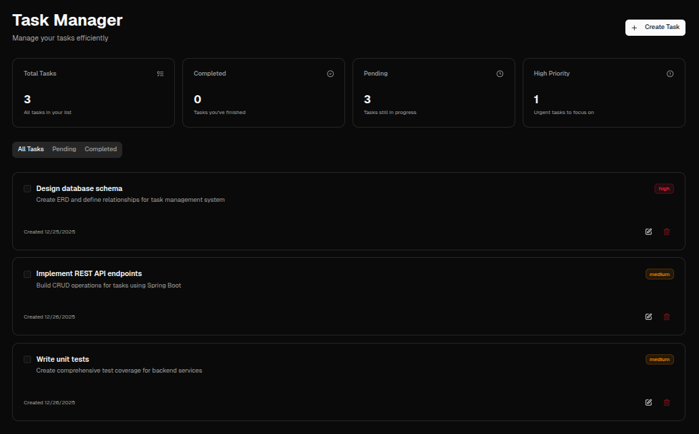
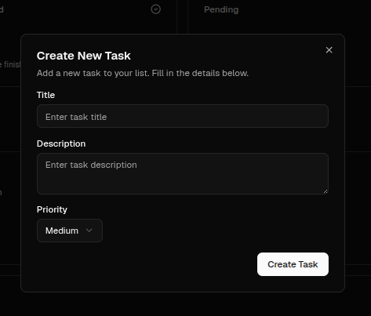

# Full-Stack Task Management Dashboard

A complete, working **task management dashboard** built with **Node.js (Next.js)**, **React**, **TypeScript**, and **Tailwind CSS**.
This repository focuses on the **frontend and API proxy layer** and works fully out of the box using an **intelligent mock fallback system**.

> ⚠️ **Note:** This repository does **NOT** include a Java Spring Boot backend. You do **not** need to run `cd backend` or `mvn spring-boot:run` to use this project.

---

## 🚀 Tech Stack

* **Frontend**: React (Next.js App Router), TypeScript, Tailwind CSS, Lucide Icons, Shadcn/UI
* **API Proxy**: Next.js Route Handlers (Node.js) with TypeScript
* **Backend API**: ❌ Not included in this repository (mocked by default)
* **Styling**: Tailwind CSS with custom design tokens

---

## 🛠️ Architecture

The application follows a modern layered architecture:

1. **Frontend (React)**
   A responsive dashboard with real-time UI updates and modern UX patterns.

2. **Edge API (Node.js / Next.js)**
   Acts as a gateway/proxy. Includes an **intelligent mock fallback system**—if no backend API is available, the app remains fully functional using an in-memory mock data store.

3. **Backend (Optional / External)**
   A Java Spring Boot REST API *can* be connected later, but it is **not part of this repository**.

---

## 📖 How to Use

### 1. Prerequisites

* [Node.js 18+](https://nodejs.org/)

> Java and Maven are **not required** for this repository.

---

### 2. Running the Application

```bash
npm install
npm run dev
```

Open `http://localhost:3000` to view the dashboard.

✅ The app runs immediately using **mock data**.
✅ All features (CRUD, stats, UI) work without any backend.

---

### 3. Backend Integration (Optional)

If you have a **separate** Spring Boot backend:

* Run it on `http://localhost:8080`
* Ensure task-related REST endpoints are available
* The app will automatically switch from mock mode to live backend mode

> ⚠️ Backend setup is **outside the scope** of this repository.

---

## ✨ Key Features

* **Full CRUD**: Create, read, update, and delete tasks
* **Smart Fallback**: Automatic mock mode when backend is unavailable
* **Real-time Stats**: Live calculation of task states
* **Modern UI**: Dark mode dashboard with filters and dialogs

---

## 📁 Project Structure

* `/app`: Next.js pages and API routes (Node.js/TypeScript)
* `/components`: Reusable React components
* `/hooks`: Custom React hooks
* `/lib`: Shared types and mock data logic

---

## 📸 Screenshots

### Dashboard Overview


> Main dashboard showing task list and statistics.  
> Uses mock data automatically when backend is not available.

### Add Task


> Modal form for creating a new task with title, description, and priority.

---

## 📄 License

MIT
